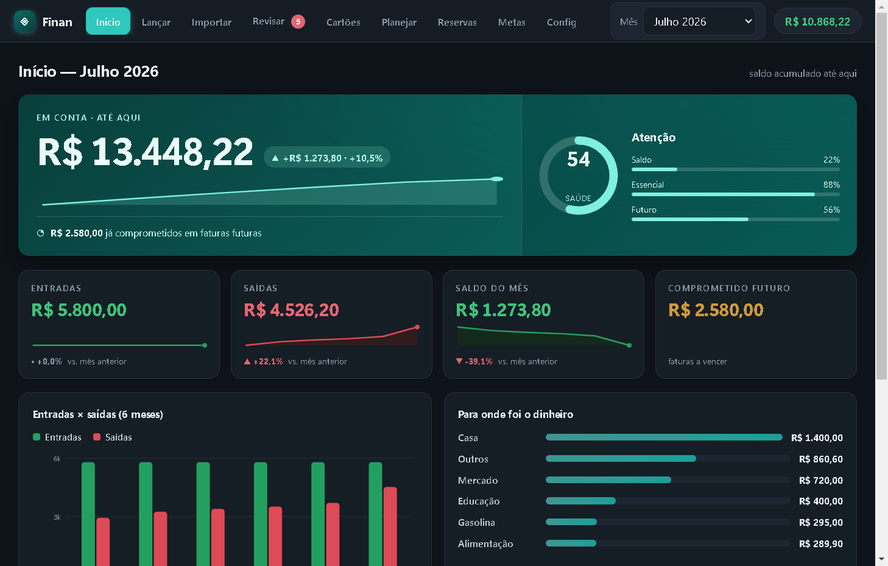
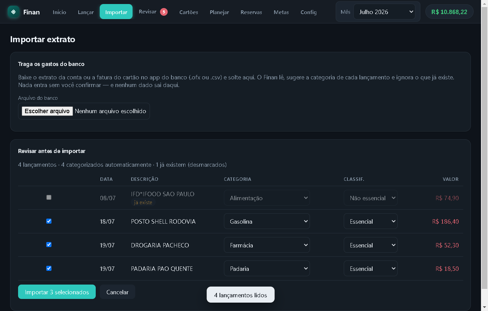
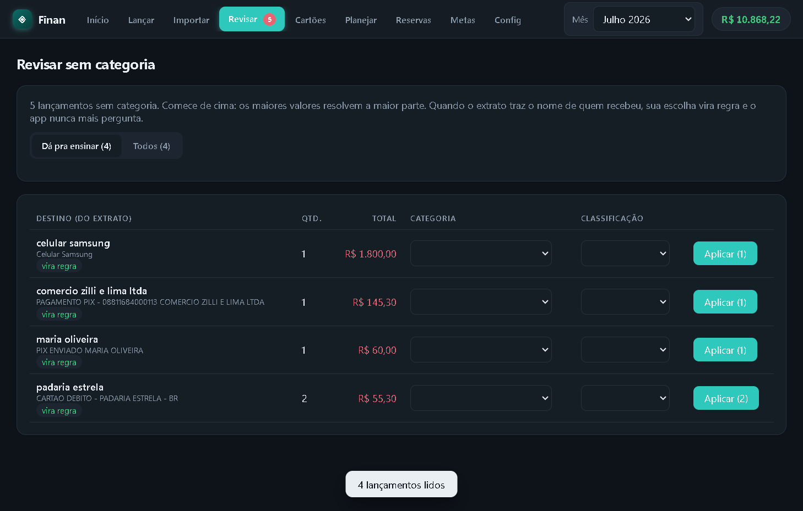
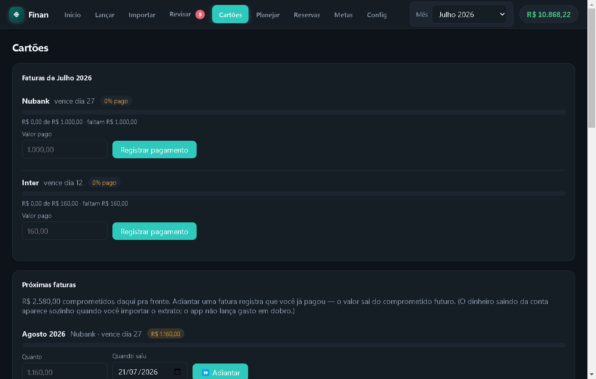
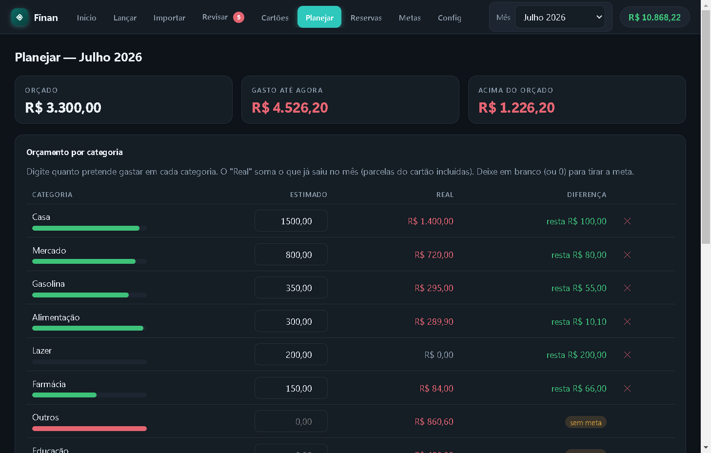
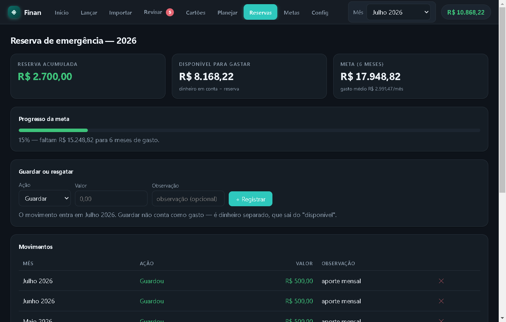
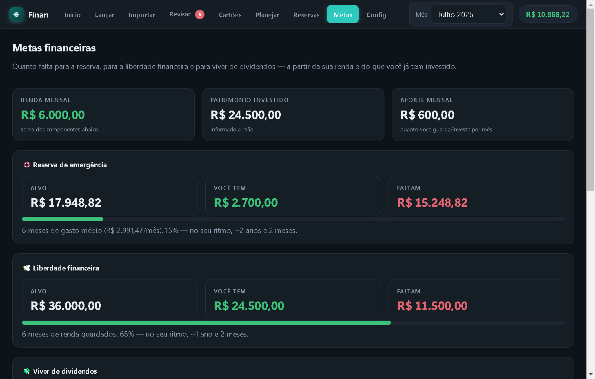
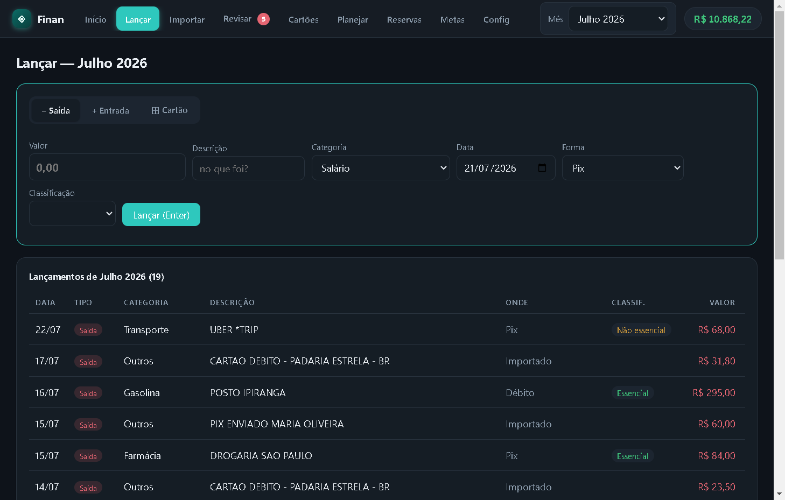
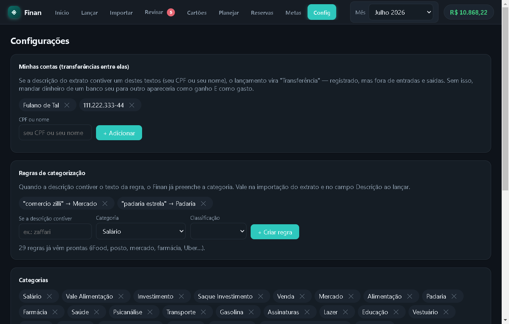
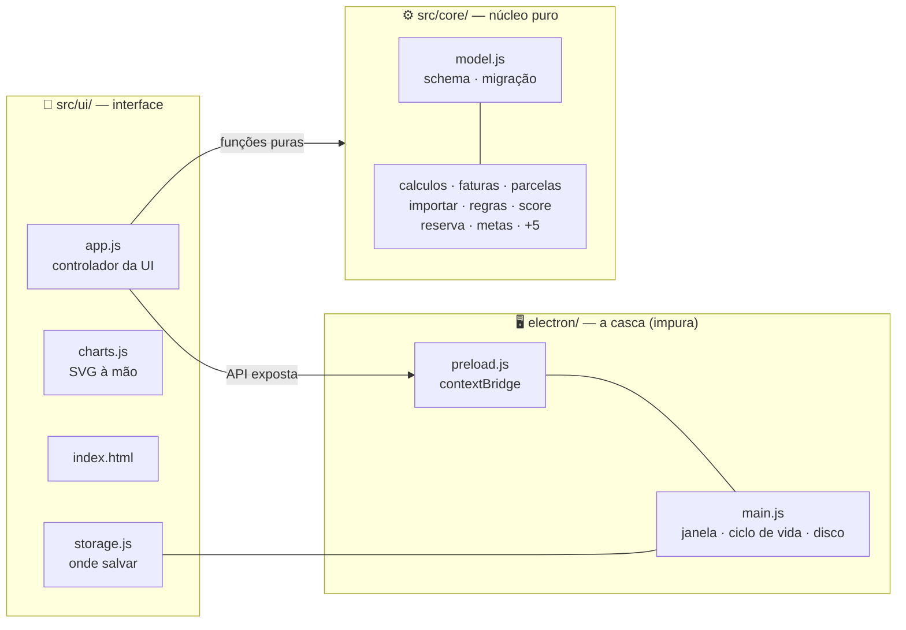

<div align="center">

# 💰 Finan

**Gestor de finanças pessoais offline, desktop e portátil — que ensina o próprio código.**

Sem nuvem. Sem conta. Sem internet. Seus dados nunca saem da sua máquina.

[](https://www.electronjs.org/)
[](#-arquitetura)
[](#-como-gerar-os-execut%C3%A1veis)
[](#-licen%C3%A7a)
[](#-material-de-estudo)



</div>

---

## 📌 O que é este repositório

O **Finan** é duas coisas ao mesmo tempo:

1. **Um app de verdade** — gestor de finanças pessoais para desktop (Electron), nascido como reconstrução independente de uma planilha de controle financeiro. Mesma lógica, mas em código legível, testado e melhorável, sem depender do Google.

2. **Um curso sobre o próprio código** — a pasta [`docs/estudo/`](docs/estudo/) contém **37 documentos didáticos** que explicam o projeto **linha a linha**: cada módulo do núcleo, a ponte com o Electron, a interface, os conceitos de programação envolvidos, um roteiro de leitura guiado e 27 exercícios com gabarito. Se você quer aprender como um app desktop em JavaScript puro funciona de ponta a ponta, este repositório foi escrito para isso.

> 🔒 **Privacidade por construção:** os dados financeiros vivem num único `dados.json` **ao lado do executável** (modo portátil — funciona até de um pendrive). Nada é enviado a lugar nenhum, e o `.gitignore` garante que nenhum dado real jamais entre no versionamento.

---

## ✨ Destaques

- 🗂️ **Importação de extratos** `.ofx` e `.csv` — com detecção de duplicatas e **categorização automática por regras** (iFood → Alimentação, posto → Gasolina…).
- 🧠 **Regras que aprendem**: o que você categoriza na revisão **vira regra** — o app não pergunta duas vezes.
- 💳 **Cartões de crédito de verdade**: fechamento/vencimento, faturas por mês, pagamento com progresso, adiantamento de fatura e parcelas — uma compra em N× vira N parcelas cujas somas **sempre** fecham o valor da compra.
- 📊 **Dashboard**: entradas, saídas, saldo, dinheiro comprometido em faturas futuras, gráfico de 6 meses, gastos por categoria e **score de saúde financeira**.
- 🎯 **Planejamento e metas**: orçamento estimado × real por categoria, reserva de emergência com *earmark* (dinheiro carimbado ≠ dinheiro gasto) e simulação de **juros compostos** até a meta.
- 🔁 **Transferências entre contas próprias** reconhecidas automaticamente — um Pix seu para você mesmo não é ganho nem gasto.
- 💾 **Escrita atômica + backups em camadas + migração versionada** (`schemaVersion`): o `dados.json` não corrompe.
- 🧪 **Testado**: suíte de testes do núcleo (`node --test`) + teste e2e que sobe o app real, lança transações e confere o arquivo salvo.

---

## 🖥️ As telas

| Tela | O que faz |
|---|---|
| **Início** | Entradas, saídas, saldo do mês, dinheiro em conta (com o comprometido em faturas futuras), gráfico de 6 meses, para onde foi o dinheiro, score de saúde e faturas do mês. |
| **Lançar** | Um formulário só — tipo (Saída / Entrada / Cartão) num botão, Enter salva, a descrição já sugere a categoria. |
| **Importar** | Solte o `.ofx`/`.csv` do banco: o Finan lê, categoriza por regras, marca o que já existe e só grava o que você confirmar. |
| **Revisar** | O que o extrato não categorizou aparece agrupado por destino. Resolva em lote; sua escolha vira regra. |
| **Cartões** | Cadastro (fechamento/vencimento), faturas do mês com pagamento e progresso, próximas faturas com botão de adiantar, parcelas em aberto. |
| **Planejar** | Orçamento por categoria: estimado × gasto real do mês, com barras de progresso e cópia do mês anterior. |
| **Reservas** | Reserva de emergência com aportes e retiradas — dinheiro *carimbado*, medido em meses de custo essencial. |
| **Metas** | Renda, patrimônio investido, aporte mensal e projeção de **juros compostos** até a liberdade financeira. |
| **Config** | Regras de categorização, categorias, formas de pagamento, contas próprias e backup `.json`. |

<div align="center">
<table>
  <tr>
    <td></td>
    <td></td>
  </tr>
  <tr>
    <td></td>
    <td></td>
  </tr>
  <tr>
    <td></td>
    <td></td>
  </tr>
  <tr>
    <td></td>
    <td></td>
  </tr>
</table>

*Todas as capturas usam **dados 100% fictícios**, gerados por [`scripts/screenshots.mjs`](scripts/screenshots.mjs) — que sobe o app de verdade numa pasta temporária e fotografa cada tela.*

</div>

---

## 📚 Material de estudo

O diferencial deste repositório. **37 documentos** em [`docs/estudo/`](docs/estudo/) cobrem 100% do código — cada arquivo-fonte tem um "espelho" `*.explicado.md` que o percorre linha a linha, com verificação automática de que **nenhuma linha do fonte ficou de fora e nenhuma linha foi inventada**.

**Comece por aqui:** [`ROTEIRO.md`](docs/estudo/ROTEIRO.md) — a ordem de leitura pensada para cada documento chegar com o vocabulário do anterior já pronto.

### As quatro camadas

| Camada | Documentos | O que você aprende |
|---|---|---|
| 🗺️ **Orientação** | [`MAPA.md`](docs/estudo/MAPA.md) · [`ROTEIRO.md`](docs/estudo/ROTEIRO.md) · [`FLUXOGRAMA.md`](docs/estudo/FLUXOGRAMA.md) | Onde cada coisa mora, por onde o app começa e os 7 caminhos que o dado percorre. |
| ⚙️ **Núcleo puro** | `model` · `calculos` · `faturas` · `parcelas` · `faturasPagas` · `importar` · `regras` · `revisar` · `score` · `planejamento` · `reserva` · `metas` · `index` (todos `.explicado.md`) | Dinheiro em centavos, estado imutável, regra de fatura por fechamento, explosão de parcelas, parsing de OFX/CSV com heurística BR/US, earmark, juros compostos. |
| 🌉 **Ponte & UI** | `storage` · `main` · `preload` · `index.html` · `charts` · `app.css` · `app.explicado.md` + **`app.js` em 7 partes** | Modo portátil, escrita atômica, segurança do Electron (`contextBridge`, `contextIsolation`), SVG feito à mão, tema claro/escuro, e o controlador inteiro da UI. |
| 🎓 **Conceitual** | [`CONCEITOS.md`](docs/estudo/CONCEITOS.md) · [`GLOSSARIO.md`](docs/estudo/GLOSSARIO.md) · [`DECISOES.md`](docs/estudo/DECISOES.md) · [`BUILD.md`](docs/estudo/BUILD.md) · [`EXEMPLO-DADOS.md`](docs/estudo/EXEMPLO-DADOS.md) · [`testes.explicado.md`](docs/estudo/testes.explicado.md) · [`EXERCICIOS.md`](docs/estudo/EXERCICIOS.md) | Os padrões que se repetem (guard clause, clamp, spread imutável…), o **porquê** de cada decisão (Electron e não PWA/Tauri, JS puro e não React, JSON e não SQLite), um `dados.json` fictício anotado campo a campo, os testes um a um, e **27 exercícios** do básico ao avançado com gabarito oculto. |

> 💡 **Só tem uma hora?** Leia [`MAPA.md`](docs/estudo/MAPA.md) + [`FLUXOGRAMA.md`](docs/estudo/FLUXOGRAMA.md) e saia com o mapa inteiro na cabeça.

O roteiro insiste num método: **estude com o app aberto do lado**. Cada etapa termina com uma ação concreta na tela ("lance uma compra em 3× e veja as 3 parcelas caírem nos meses certos") — ler *e ver acontecer* fecha o entendimento de um jeito que leitura sozinha não fecha.

---

## 🏗️ Arquitetura

**Núcleo puro, casca impura.** Toda a regra de negócio vive em `src/core/` como funções puras — `(estado, dados) → novo estado` — sem tocar disco, DOM ou rede. Só a casca (Electron) tem efeitos colaterais.



**Princípios inegociáveis** (detalhados em [`docs/ARQUITETURA.md`](docs/ARQUITETURA.md) e [`docs/estudo/DECISOES.md`](docs/estudo/DECISOES.md)):

1. **Dinheiro em centavos** (inteiros) — nunca float.
2. **Nunca corromper `dados.json`** — escrita atômica, backups, migração por `schemaVersion`.
3. **Soma das parcelas == valor da compra** — sempre.
4. **Nenhum dado financeiro real no git** — garantido por `.gitignore`.
5. **Comportamento importante vira teste** — não fica só na cabeça de quem escreveu.

---

## 🚀 Como rodar

```bash
npm install
npm start            # abre a janela do app
npm run test:core    # testes da lógica pura (parcelas, faturas, totais, score…)
npm run test:e2e     # sobe o app de verdade, lança transações e confere o dados.json
```

### Como gerar os executáveis

```bash
npm run dist:linux   # gera dist/Finan-*.AppImage   (rode no Linux)
npm run dist:win     # gera dist/"Finan *.exe"      (rode no Windows)
```

> ⚠️ **Windows — armadilha do `winCodeSign`:** na primeira build, o electron-builder extrai um pacote com symlinks e a sessão comum falha com `Cannot create symbolic link`. Rode o terminal **como administrador** (ou ative o Modo Desenvolvedor) só na primeira vez — depois fica em cache. Detalhes em [`docs/estudo/BUILD.md`](docs/estudo/BUILD.md).

### Atalho no sistema e modo pendrive

```bash
npm run atalho:linux     # Menu de aplicativos + Área de trabalho (Linux)
npm run atalho:win       # Menu Iniciar + Área de trabalho (Windows)
npm run pendrive:linux   # sincroniza app portátil + fonte para o pendrive
npm run pendrive:win     #   (nunca sobrescreve o dados.json que já estiver lá)
```

O app procura o `dados.json` **ao lado do executável** — é isso que o torna portátil: o histórico anda com o pendrive.

### Banco que só exporta `.xls` binário?

```bash
pip install --user xlrd
python3 scripts/btg-para-csv.py ~/Downloads/Extrato_*.xls
# depois solte o .csv gerado na tela Importar
```

---

## 📁 Estrutura

```
finan/
├── electron/        # casca desktop: janela, ciclo de vida, ponte de arquivos (IPC)
├── src/
│   ├── core/        # núcleo puro: modelo, parcelas, faturas, importação, score…
│   ├── ui/          # telas, gráficos SVG, storage
│   └── styles/      # CSS (tema claro/escuro automático)
├── docs/
│   ├── ARQUITETURA.md   # modelo de dados, decisões, tabela de paridade
│   └── estudo/          # 📚 os 37 documentos didáticos
├── scripts/         # atalhos, sync pendrive, conversor .xls→.csv, categorias
├── test/            # testes do núcleo (node:test) + smoke e2e
├── build/           # ícone e recursos de empacotamento
└── package.json
```

---

## ⚠️ Aviso

Este projeto é uma ferramenta pessoal de organização e um material de estudo de programação. **Não é aconselhamento financeiro, contábil ou de investimentos.**

---

## 📄 Licença

**Copyright © 2026 Lukas Ceratti Agnese** ([@LucasCerattoRS](https://github.com/LucasCerattoRS)). Todos os direitos reservados sobre a obra original.

Este projeto (código **e** material didático) é disponibilizado sob a licença
**[Creative Commons Atribuição-NãoComercial-CompartilhaIgual 4.0 Internacional (CC BY-NC-SA 4.0)](https://creativecommons.org/licenses/by-nc-sa/4.0/deed.pt-br)** — veja o texto completo em [`LICENSE`](LICENSE).

| ✅ Você pode | ❌ Você não pode |
|---|---|
| Usar, estudar e executar o app | Usar comercialmente (vender, embutir em produto pago, monetizar) |
| Compartilhar e redistribuir | Remover ou omitir o crédito ao autor |
| Adaptar, remixar e criar derivados | Licenciar derivados sob termos diferentes |
| — sempre **com crédito** ao autor | (derivados devem manter **CC BY-NC-SA 4.0**) |

Para usos fora desses termos (ex.: uso comercial), entre em contato com o autor via GitHub.

---

<div align="center">

Feito com teimosia e centavos inteiros por **[Lukas Ceratti Agnese](https://github.com/LucasCerattoRS)** 🇧🇷

*Se este projeto te ensinou algo, uma ⭐ ajuda outras pessoas a encontrá-lo.*

</div>
